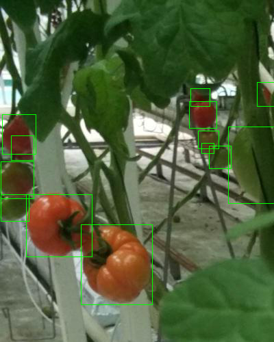

# Pascal VOC Annotation to Image Converter Script

## Usage
Create annotated images with bounding boxes from PASCAL VOC `.xml` files.

## Setup
* Clone the repository close to your dataset on your local machine.
    ```sh
    git clone https://github.com/jonathanzhang53/pascal_voc_to_image.git
    ```
* Install requirements.
    ```sh
    pip install -r requirements.txt
    ```
* Edit the variables `images_path`, `annotations_path`, `output_path` to match your own relative paths
    ```py
    images_path = "IMAGES/DIRECTORY/"
    annotations_path = "ANNOTATIONS/DIRECTORY/"
    output_path = "OUTPUT/DIRECTORY/" + "{}.png"
    ```
### Alternatively
* Download `main.py` to your dataset folder and edit the variables mentioned above

## Run
* Execute from command line
    ```sh
    python main.py
    ```

## Notes
* Written with Python 3.9
* Demo vanilla script with `/sample_data/` directory by running the execution command
	

## Attributions
Sample data from public [Kaggle dataset](https://www.kaggle.com/kangdali/tomato)
